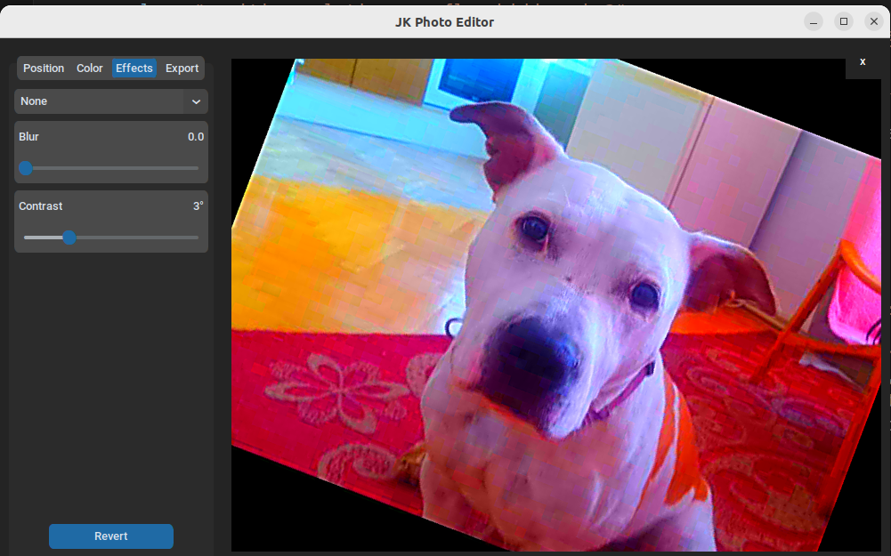

# Python Photo Editor

## Introduction
Welcome to the Python Photo Editor, a sophisticated image editing tool crafted with advanced Object-Oriented Programming (OOP) techniques.

## Features
- **Advanced Editing Tools**: Includes filters, adjustments, and cropping options.
- **User-Friendly Interface**: Designed for ease of use without sacrificing functionality.
- **Built with Python**: Utilizes powerful libraries such as Pillow and OpenCV.

## Installation
To get started with this photo editor, follow these steps:
1. Clone the repository:
`git clone https://github.com/jkrbec/photo_editor.git`
2. Navigate to the project directory:
`cd photo_editor`
3. Install the required dependencies:
`pip install -r requirements.txt`
4. Run the app:
`python main.py`

## Acknowledgments
Special thanks to the Clear Code YouTube channel for their invaluable Python programming tutorials and resources, which have been instrumental in the development of this project.

